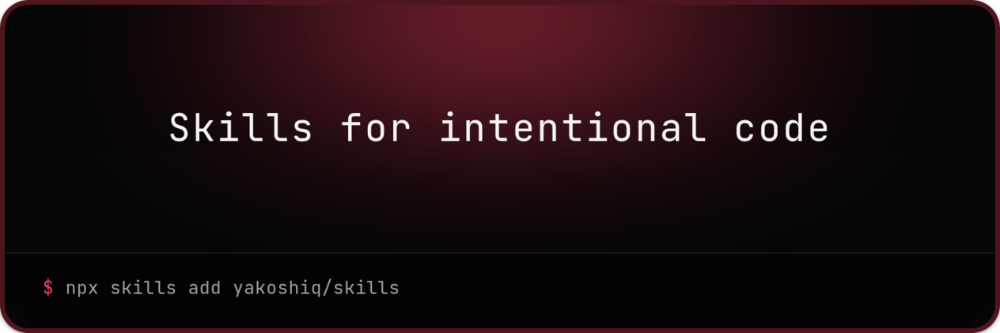
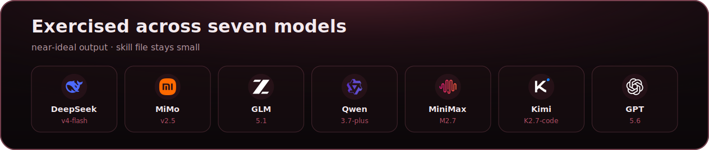

<a href="https://skills.yakoshi.dev">
  
</a>

# Skills for intentional code

[](https://skills.sh/yakoshiq/skills)

Agent skills that push toward code humans can review: clear domain meaning, honest failures, comments only when they earn their place, and tests that prove real behavior.

Default agent output often looks finished and still hides the hard parts - vague names, one `false` for every failure, narration comments, missing whys, green tests without confidence. These skills are short on purpose. Each one is exercised on several models until the result is near-ideal and the skill file stays small:



## Install

```bash
npx skills add yakoshiq/skills
```

In the interactive picker, select the **Intentional Code** group to install the full set at once.

One skill:

```bash
npx skills add yakoshiq/skills --skill essential-comments
```

Global:

```bash
npx skills add yakoshiq/skills -g
```

Prefer an explicit invoke (`/skill:essential-comments` or "use essential-comments"). Auto-trigger from the description alone depends on the model.

Before / after pages are human-facing documentation. They live outside the skill folders so installed skills stay limited to model-facing instructions.

## Reference

- **[essential-comments](./skills/essential-comments/SKILL.md)** - Add, keep, or remove comments so only human-useful remarks remain: why, invariants, tradeoffs, external constraints - not narration or restated code. Works as cleanup and when writing new code. [Before / after](./docs/examples/essential-comments.md).
- **[jane-street-style](./skills/jane-street-style/SKILL.md)** - Design, refactor, or review when semantic clarity is the explicit goal: precise domain names, explicit failures and effects, useful domain types, and minimal accidental complexity. [Before / after](./docs/examples/jane-street-style.md).
- **[surgical-changes](./skills/surgical-changes/SKILL.md)** - Implement fixes and small features as the smallest coherent change that solves the request while preserving unrelated behavior and keeping cleanup out of the diff. [Before / after](./docs/examples/surgical-changes.md).
- **[tests-that-matter](./skills/tests-that-matter/SKILL.md)** - Write or review tests that prove observable behavior, failure semantics, invariants, and boundaries - not mock theater or coverage without confidence. [Before / after](./docs/examples/tests-that-matter.md).

## License

[MIT](./LICENSE)
